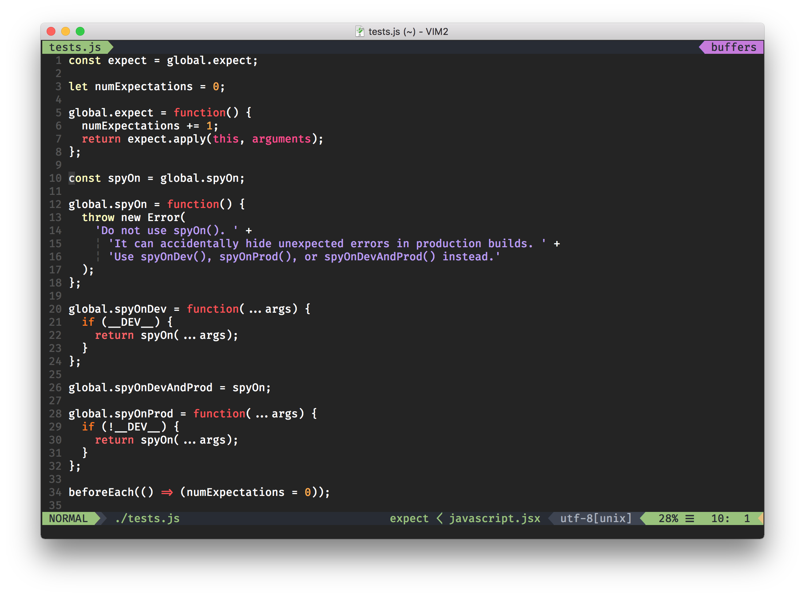
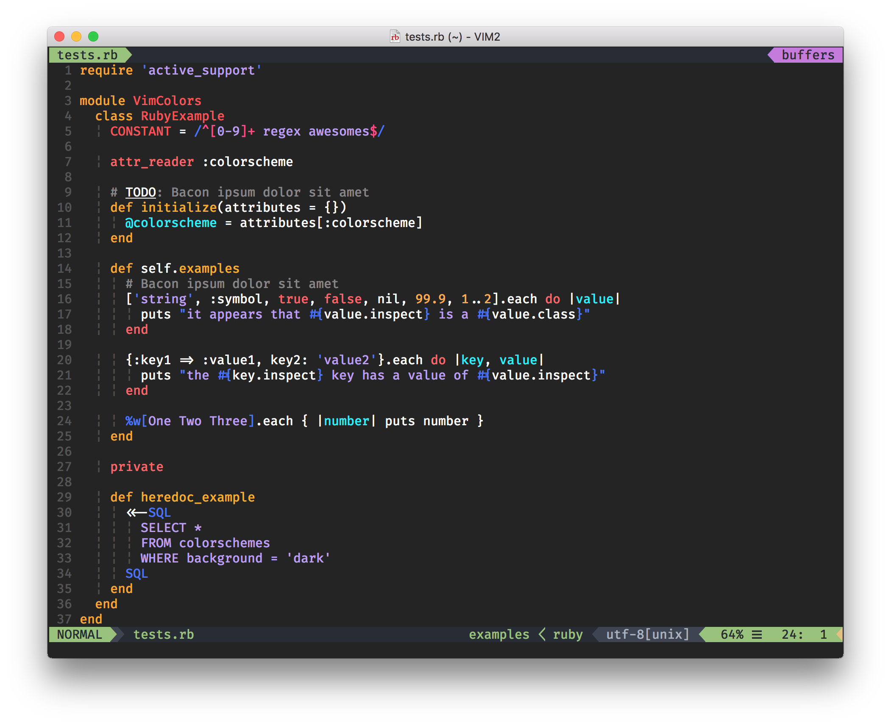

# Rupza

> 🔱 a dark colorscheme to GUI Vim. 

## Installation
Just copy the file `colors/rupza.vim` to your `~/.vim/colors/` directory.

## Usage

In your `~/.vimrc` file: 

```vimrc
colorscheme rupza
```

## Screenshots




## Contributing
1. Fork it!
2. Create your feature branch: `git checkout -b my-new-feature`
3. Commit your changes: `git commit -am 'Add some feature'`
4. Push to the branch: `git push origin my-new-feature`
5. Submit a pull request :D

## License
Felipe Sousa @ MIT LICENSE
